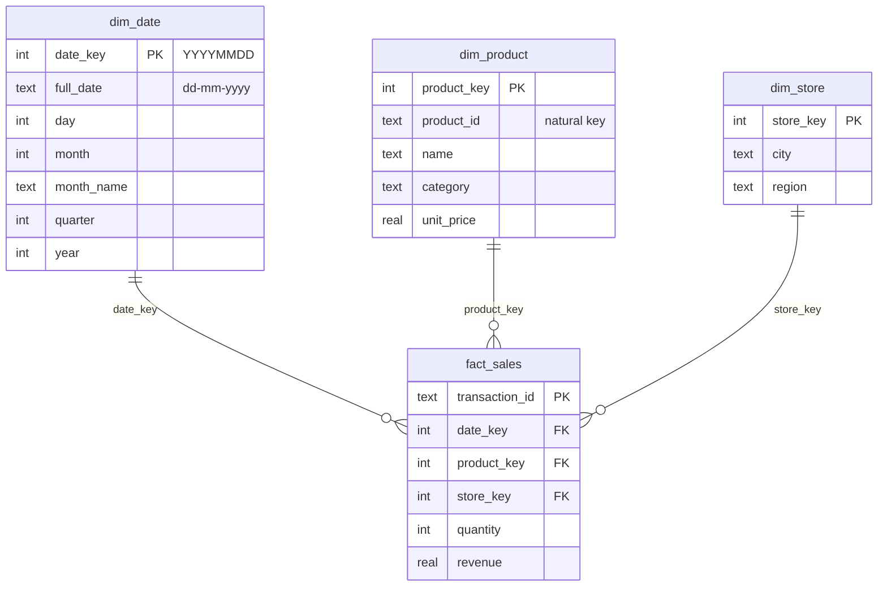
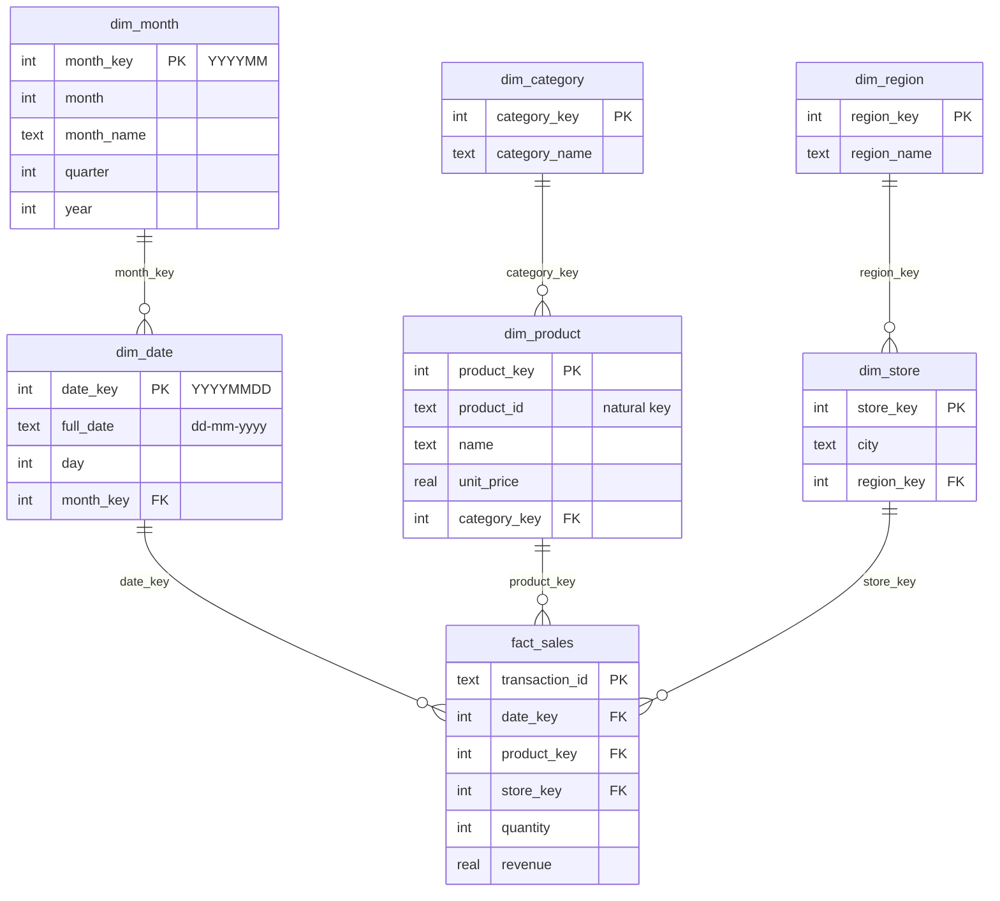

# csa806-datawarehousing-etl

CSA806 Module 2 (Data Warehousing): an end-to-end **ETL** demo on retail sales data, built twice to compare
two warehouse designs. Each folder is a **self-contained project** with its own data, pipeline, reports and web UI.

| Project | Schema | Tables | Dashboard |
|---|---|---|---|
| [`star_schema/`](star_schema/) | Star: flat dimensions | 4 (`fact_sales` + 3 dims) | http://127.0.0.1:8000 |
| [`snowflake_schema/`](snowflake_schema/) | Snowflake: dimensions normalised into hierarchies | 7 (`fact_sales` + 6 dims) | http://127.0.0.1:8001 |

Both use the same source data and the same Extract and Transform steps. Only **Load** (the schema) and the
report **SQL** differ, and the report numbers come out identical.

## Star vs snowflake

### Star



### Snowflake



| | Star | Snowflake |
|---|---|---|
| Dimension design | Denormalised (category on each product) | Normalised (category in its own table) |
| Joins for "revenue by category" | 1 | 2 |
| Redundancy | Higher | Lower |
| Query simplicity and speed | Simpler, faster | More joins |
| Typical use | Most BI / reporting warehouses | Large or frequently changing hierarchies |

## Run a project

**macOS / Linux**

```bash
cd star_schema            # or snowflake_schema
python3 -m venv .venv && .venv/bin/pip install -r requirements.txt   # once
.venv/bin/uvicorn app:app --reload                                   # add --port 8001 for snowflake
```

**Windows (PowerShell or Command Prompt)**

```powershell
cd star_schema            # or snowflake_schema
py -m venv .venv
.venv\Scripts\python -m pip install -r requirements.txt               # once
.venv\Scripts\python -m uvicorn app:app --reload                      # add --port 8001 for snowflake
```

See each project's README for details.
