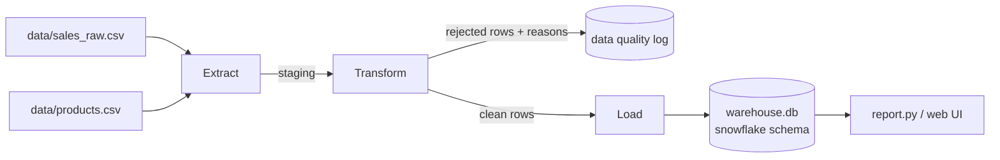

# ETL Demo: Sales Data Warehouse (Snowflake Schema)

An end-to-end **Extract → Transform → Load** pipeline. It takes messy retail sales CSVs and loads them into a
**SQLite snowflake schema**. A small web dashboard (FastAPI + Vue + ECharts + Tailwind) shows the results.

This is a self-contained project. `../star_schema` runs the same pipeline into a star schema, for comparison.

## Run it

```bash
python3 -m venv .venv && .venv/bin/pip install -r requirements.txt   # once

python3 generate_data.py   # (optional) regenerate the dummy CSVs in data/
python3 etl.py             # run the pipeline -> warehouse.db
python3 report.py          # analytical queries in the terminal
.venv/bin/uvicorn app:app --reload --port 8001   # dashboard at http://127.0.0.1:8001
```

`generate_data.py`, `etl.py` and `report.py` use only the Python standard library. Only the dashboard needs the venv.

## The pipeline



| Step | What happens | Where |
|---|---|---|
| **Extract** | Read `data/sales_raw.csv` (~100 transactions, Jan–Dec 2026) and `data/products.csv` (catalog) | `etl.extract()` |
| **Transform** | Drop duplicates · standardise mixed date formats (`2026-01-05` / `05/01/2026`) to dd-mm-yyyy (`05-01-2026`) · trim and title-case city names · reject missing or negative quantities · reject unknown products · add a region (enrichment) · compute `revenue = qty × unit_price` | `etl.transform()` |
| **Load** | Rebuild the snowflake schema in `warehouse.db`: parent tables first (month, category, region), then dimensions, then facts | `etl.load()` |

Rejected rows are logged with a reason instead of being dropped silently.

## Why a snowflake schema?

The dimensions are normalised into hierarchies, so each category, region and month is stored once and referenced by key.
That means less redundancy and one place to make an edit. The cost is extra joins: "revenue by category" needs
`fact_sales → dim_product → dim_category` (2 joins) where the star schema needs 1.

## Snowflake schema

```mermaid
erDiagram
    dim_month    ||--o{ dim_date    : month_key
    dim_category ||--o{ dim_product : category_key
    dim_region   ||--o{ dim_store   : region_key
    dim_date     ||--o{ fact_sales  : date_key
    dim_product  ||--o{ fact_sales  : product_key
    dim_store    ||--o{ fact_sales  : store_key

    fact_sales {
        text transaction_id PK
        int  date_key FK
        int  product_key FK
        int  store_key FK
        int  quantity
        real revenue
    }
    dim_date {
        int  date_key PK "YYYYMMDD"
        text full_date "dd-mm-yyyy"
        int  day
        int  month_key FK
    }
    dim_month {
        int  month_key PK "YYYYMM"
        int  month
        text month_name
        int  quarter
        int  year
    }
    dim_product {
        int  product_key PK
        text product_id "natural key"
        text name
        real unit_price
        int  category_key FK
    }
    dim_category {
        int  category_key PK
        text category_name
    }
    dim_store {
        int  store_key PK
        text city
        int  region_key FK
    }
    dim_region {
        int  region_key PK
        text region_name
    }
```



## Files

| File | Purpose |
|---|---|
| `generate_data.py` | Builds dummy CSVs with planted data-quality problems (fixed seed, so the output is reproducible) |
| `etl.py` | The ETL pipeline |
| `queries.py` | SQL against the warehouse (shared by the report and the API) |
| `report.py` | Prints the reports in the terminal |
| `app.py` | FastAPI: runs each step on its own and serves the UI |
| `static/index.html` | Web UI with one tab per step (see below) |

## Web UI

Each step has its own tab, with a note explaining what it does and why it matters:

| Tab | Shows |
|---|---|
| **1 · Extract** | Raw sales and the product catalog exactly as read, messy values included |
| **2 · Transform** | Every value fixed (before → after), rejected rows with reasons, the clean rows |
| **3 · Load** | Mermaid ER diagram of the schema, row count and the first 5 rows of each warehouse table |
| **4 · Report** | KPIs, revenue by month, category and store (ECharts), top products |

A step can only run after the one before it. **Run all steps** runs the whole pipeline and opens the Report tab.
**Clear DB** deletes `warehouse.db` and clears the staging area so the steps can be rerun from scratch.

API: `POST /api/extract` · `POST /api/transform` · `POST /api/load` · `POST /api/reset` · `GET /api/state` · `GET /api/dashboard`
