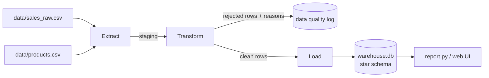
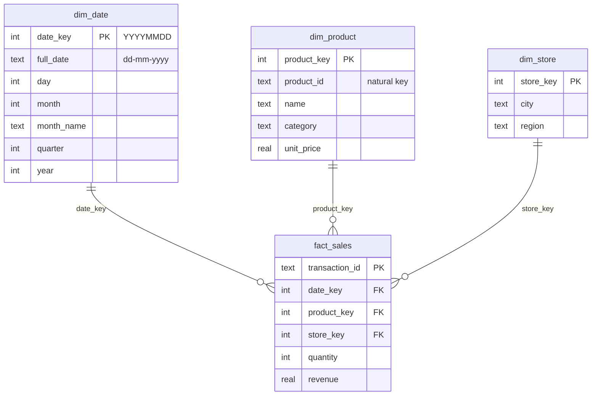

# ETL Demo: Sales Data Warehouse (Star Schema)

An end-to-end **Extract → Transform → Load** pipeline. It takes messy retail sales CSVs and loads them into a
**SQLite star schema**. A small web dashboard (FastAPI + Vue + ECharts + Tailwind) shows the results.

This is a self-contained project. `../snowflake_schema` runs the same pipeline into a snowflake schema, for comparison.

## Run it

### macOS / Linux

```bash
python3 -m venv .venv && .venv/bin/pip install -r requirements.txt   # once

python3 generate_data.py   # (optional) regenerate the dummy CSVs in data/
python3 etl.py             # run the pipeline -> warehouse.db
python3 report.py          # analytical queries in the terminal
.venv/bin/uvicorn app:app --reload   # dashboard at http://127.0.0.1:8000
```

### Windows (PowerShell or Command Prompt)

Needs Python 3.10+ from [python.org](https://www.python.org/downloads/) (tick **Add python.exe to PATH** during install).

```powershell
py -m venv .venv
.venv\Scripts\python -m pip install -r requirements.txt   # once

.venv\Scripts\python generate_data.py   # (optional) regenerate the dummy CSVs in data\
.venv\Scripts\python etl.py             # run the pipeline -> warehouse.db
.venv\Scripts\python report.py          # analytical queries in the terminal
.venv\Scripts\python -m uvicorn app:app --reload   # dashboard at http://127.0.0.1:8000
```

These call the venv's Python directly, so there's no need to activate it (PowerShell blocks `Activate.ps1` by
default). If `py` is not found, use `python` instead.

`generate_data.py`, `etl.py` and `report.py` use only the Python standard library. Only the dashboard needs the venv.

## The pipeline



| Step | What happens | Where |
|---|---|---|
| **Extract** | Read `data/sales_raw.csv` (~100 transactions, Jan–Dec 2026) and `data/products.csv` (catalog) | `etl.extract()` |
| **Transform** | Drop duplicates · standardise mixed date formats (`2026-01-05` / `05/01/2026`) to dd-mm-yyyy (`05-01-2026`) · trim and title-case city names · reject missing or negative quantities · reject unknown products · add a region (enrichment) · compute `revenue = qty × unit_price` | `etl.transform()` |
| **Load** | Rebuild the star schema in `warehouse.db`, map natural keys to surrogate keys, insert the fact rows | `etl.load()` |

Rejected rows are logged with a reason instead of being dropped silently.

## Why a star schema?

Each dimension is a single flat (denormalised) table, one join from the fact table. Queries are simple and fast.
The cost is some repeated values: the category name is stored on every product, and the region on every store.

## Star schema



## Files

| File | Purpose |
|---|---|
| `generate_data.py` | Builds dummy CSVs with planted data-quality problems (fixed seed, so the output is reproducible) |
| `etl.py` | The ETL pipeline |
| `queries.py` | SQL against the warehouse (shared by the report and the API) |
| `report.py` | Prints the reports in the terminal |
| `app.py` | FastAPI: runs each step on its own and serves the UI |
| `static/index.html` | Web UI with one tab per step (see below) |

## Web UI

Each step has its own tab, with a note explaining what it does and why it matters:

| Tab | Shows |
|---|---|
| **1 · Extract** | Raw sales and the product catalog exactly as read, messy values included |
| **2 · Transform** | Every value fixed (before → after), rejected rows with reasons, the clean rows |
| **3 · Load** | Mermaid ER diagram of the schema, row count and the first 5 rows of each warehouse table |
| **4 · Report** | KPIs, revenue by month, category and store (ECharts), top products |

A step can only run after the one before it. **Run all steps** runs the whole pipeline and opens the Report tab.
**Clear DB** deletes `warehouse.db` and clears the staging area so the steps can be rerun from scratch.

API: `POST /api/extract` · `POST /api/transform` · `POST /api/load` · `POST /api/reset` · `GET /api/state` · `GET /api/dashboard`
